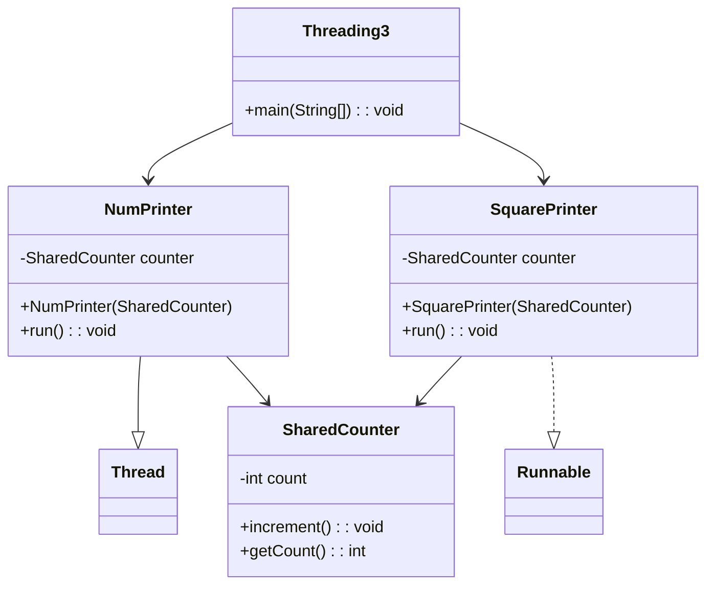

# Threading in Java

## Description
This program demonstrates multithreading in Java using both the `Thread` class and the `Runnable` interface.  
Two threads execute concurrently while accessing a shared resource. Synchronization is applied to ensure thread-safe operations and avoid race conditions.

---

## Objectives
- Understand Java multithreading concepts  
- Create threads using `Thread` and `Runnable`  
- Implement synchronization for shared data  
- Observe concurrent execution of threads  

---

## Program Overview
The program consists of the following components:

### 1. SharedCounter
- Stores a shared integer variable  
- Uses synchronized methods to ensure thread safety  

### 2. NumPrinter (Thread)
- Prints numbers from 1 to 10  
- Increments the shared counter after each operation  

### 3. SquarePrinter (Runnable)
- Prints the square of numbers from 1 to 10  
- Also increments the shared counter  

### 4. Threading3 (Main Class)
- Creates and starts both threads  
- Waits for thread completion using `join()`  

---

## Features
- Parallel execution using multithreading  
- Thread-safe counter using synchronization  
- Demonstrates both `Thread` and `Runnable` approaches  
- Clean and readable output  

---

## Working Principle
1. A shared `SharedCounter` object is created  
2. `NumPrinter` extends `Thread` and prints numbers  
3. `SquarePrinter` implements `Runnable` and prints squares  
4. Both threads increment the shared counter safely  
5. The main thread waits until both threads finish  
6. Final counter value is displayed  

---

## UML Class Diagram

## Tools & Technologies

- Programming Language: Java
- Concept: Multithreading
- IDE: IntelliJ IDEA / Eclipse / NetBeans

---

## Conclusion

This program effectively demonstrates multithreading using both Thread and Runnable.
It shows how synchronization ensures safe access to shared resources in a concurrent environment.

---

## Author

- Ântor Bhöwmîk
- Department of Computer Science
- Green University of Bangladesh
- Java Lab Assignmen
